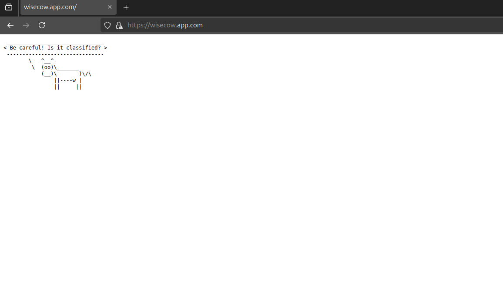

# Wisecow Application Deployment

## Overview
This repository contains the Wisecow application, which delivers cow-themed wisdom quotes. The project aims to containerize and deploy the application in a Kubernetes environment, implement continuous integration and deployment (CI/CD) using GitHub Actions, and ensure secure TLS communication.

## Prerequisites
- Docker installed
- Kubernetes cluster (e.g., Minikube)
- kubectl installed
- GitHub account

## Project Structure
- **wisecow.sh**: Script to run the Wisecow application.
- **Dockerfile**: Defines the Docker image for the application.
- **Kubernetes Manifests**: YAML files for deploying the application in Kubernetes.
- **GitHub Actions Workflow**: CI/CD pipeline setup.

## Steps to Deploy

### 1. Dockerization
Create a Dockerfile to containerize the Wisecow application.

### 2. Kubernetes Deployment
Create Kubernetes manifests for namespace, deployment, service, and ingress.

### 3. TLS Implementation
Create a TLS secret for secure communication.

### 4. CI/CD Pipeline with GitHub Actions
Set up a GitHub Actions workflow to automate the build and deployment process.

## Requirements
1. Dockerize the Wisecow application and create Kubernetes manifests.
2. Implement a GitHub Actions workflow to automate the build and push process.
3. [Challenge Goal]: Enable secure TLS communication.

## Expected Artifacts
1. GitHub repository with the app, Dockerfile, Kubernetes manifests, and other artifacts.
2. GitHub Actions workflow.
3. Private GitHub repository with access enabled for `nyrahul` and `SujithKasireddy`.

## Usage Instructions

### Prerequisites
Install required packages:
```
sudo apt install fortune-mod cowsay -y
```

## What to expect?


### Notes
This repository was cloned from nyrahul/wisecow and extended to include Dockerization, Kubernetes deployment, and a CI/CD pipeline setup.
